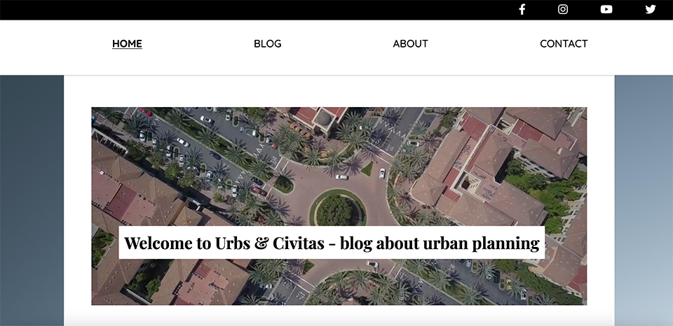
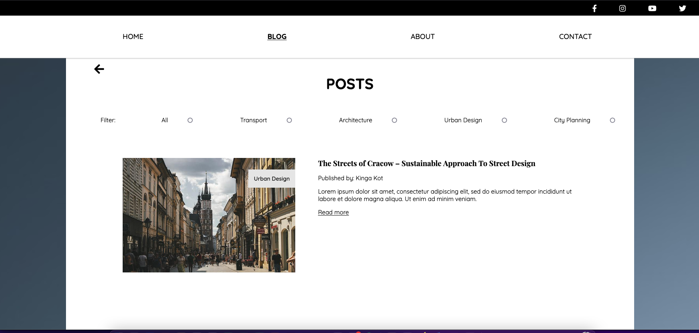

# Blog

Blog site built for the project exam. Theme for the blog is architecture and urban planning.

<div id="images">


</div>

## Description

Blog site that´s built for the project exam. The goal was to put into practice all the skills I have learned during the first year of frontend development study. Blog posts are created and stored in Wordpress used as a Headless CMS and then fetched data are displayed on the website. Blog specific page is created dynamically with the use of query string parameter.

### Site architecture

- Home page
- About page
- List of blog posts
- Blog post specific pages
- Contact

## Built With

- HTML5
- CSS
- Javascript
- API from Wordpress

## Getting Started

Project can be accessed through following repository:

```
gh repo clone Noroff-FEU-Assignments/project-exam-1-Kinga89
```

---

<div id="social" align="center">
<a href="https://www.linkedin.com/in/kinga-kot-3a4b8a149/">
  
 </a>
  <a href="kotkiga89@gmail.com">
  
 </a>
</div>

<div align="center">
  
</div>
